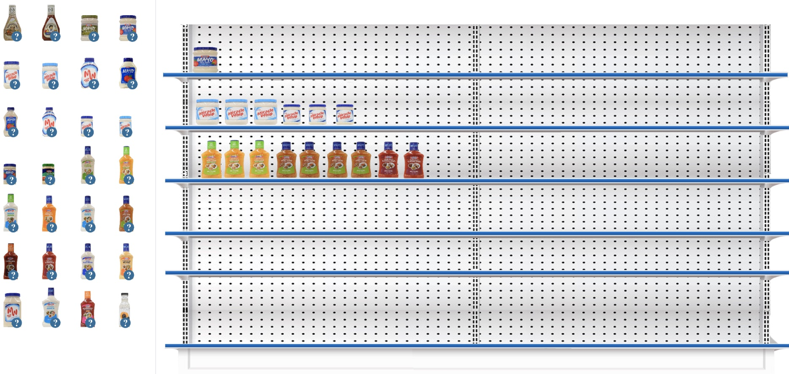

## Roles en el proyecto

- Programación

## Situación

La empresa utiliza imágenes precortadas del los artículos para enseñar el acomodo óptimo de los modulares y requiere de algo mas automátizado que permita diseñar, almacenar y enviar por correo un pdf de la organización creada por el alumno.

## Solución

Dada la facilidad que se ofrece en IOS para el manejo de gráficos y que el estandard de la empresa es Apple se decidió crear una solución nativa en IOS que permitiera a los alumnos arrastar los item seleccionados hasta el estante deseado y dejar caer el objeto de forma natural y controlando que los objetos se puedan colocar de acuerdo a su altura y espacio sobrante. Al finalizar podía grabar como quedó el modular y enviar por correo un PDF con el diseño creado. 

