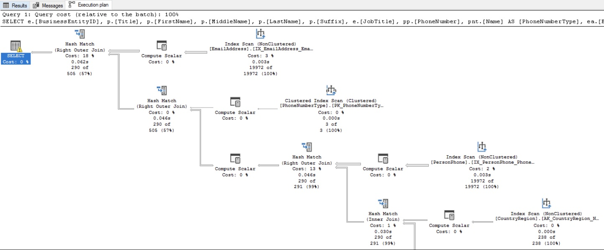

## Roles en el Proyecto

- Arquitecto Soluciones
- Coordinador equipo SWATT

## Situación

  Inicialmente el cliente contactó por un desarrollo de microservicios como solución al problema de rendimiento de las aplicaciones, sin embargo ante la duda de que los microservicios fueran la solución a su problema se contrataron diez horas de arquitectura para evaluar el estado de la situación dando como resultado que el problema no se iba a solucionar con los servicios si no en la base de datos. 

## Solución

  Se procedió a crear lo que se denomina un equipo Swatt enfocado en solucionar los problemas en un corto plazo y que propone y coordina la solución a mediano plazo.

  Se listaron y priorizaron los procesos principales para enfocarse en lo más importante de la empresa y las tareas consistieron en:

  1.  Analizar el plan de ejecución de las consultas a la Base de Datos

  

  2. Evaluación de consultas SQL en el uso de los índices existentes
  3. Evaluación de la necesitad de crear nuevos índices

  

  
  