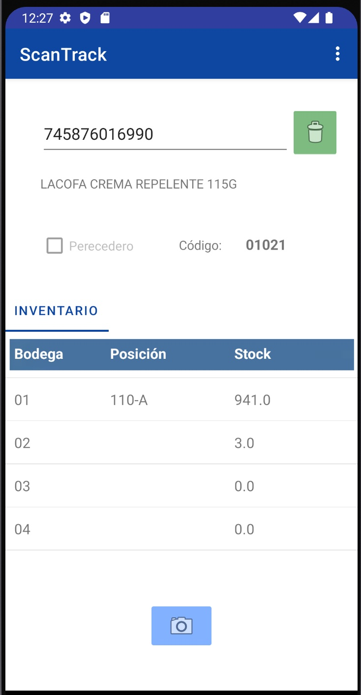
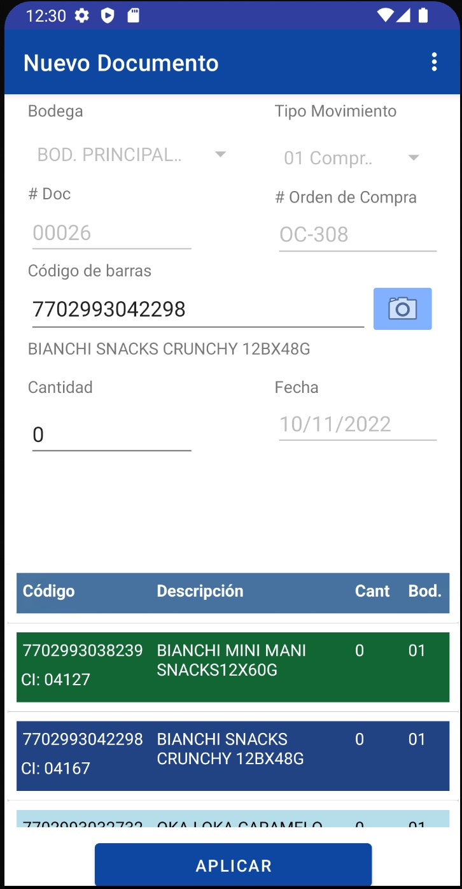

## Roles en el proyecto

- Arquitecto de Soluciones
- Diseño
- Programación

## Situación

Una mediana empresa de logística que creció muy rápido continúa con las prácticas del manejo de la bodega como cuando empezó, a raíz de ello requiere la asesoría de como poder automatizar los precesos de manejo de inventario y sobre todo de los lotes de inventario de artículos perecederos. 

## Solución

Dentro de las soluciones programáticas que se le ofrecieron fué iniciamente hacer el levantamiento del inventario de los tracks de alisto mediante una app móvil que permitiera escanear el track y el código de barras para lo cual se utilizaron los dispositivos móbiles de la empresa. Luego la app fue creciendo y se le fueron añadiendo funcionalidades quedando al día de hoy con:

- Escanning para levantar ubicaciones y existencia por track
- Alisto optimizando ruta de picking
- Checheo
- Despacho
- Entrega de mercadería contra órden de pedido

Para la distribión vía remota de la aplicación dado que no es una aplicación para el PlayStore se utilizó el MDM [Miradore]
(https://www.miradore.com/)

Ejemplo de escaneo de productos

[]

Ejemplo de captura de Alisto

[]
