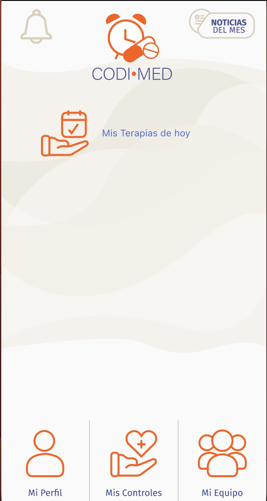
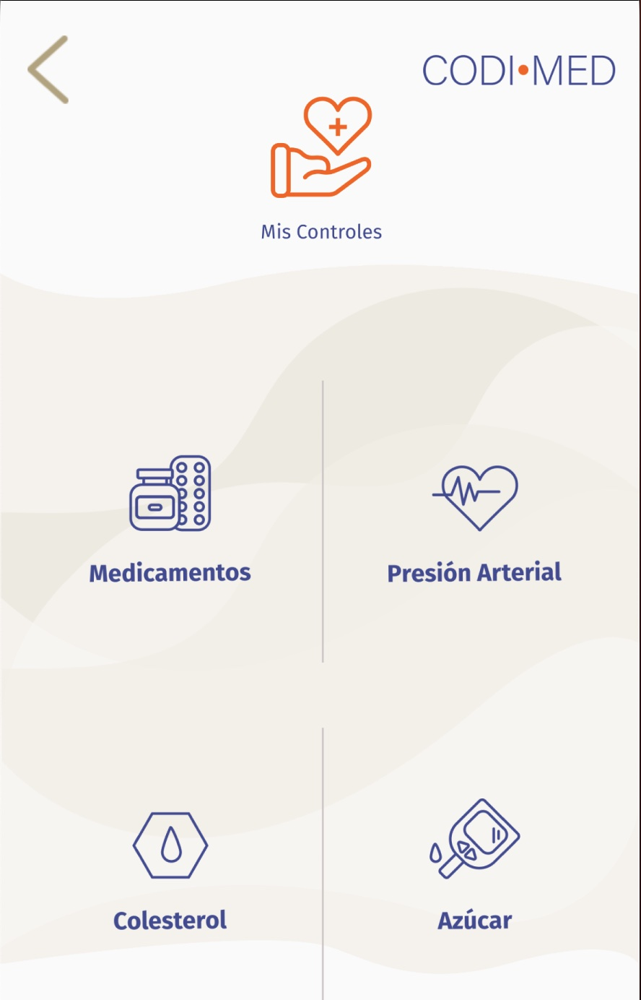
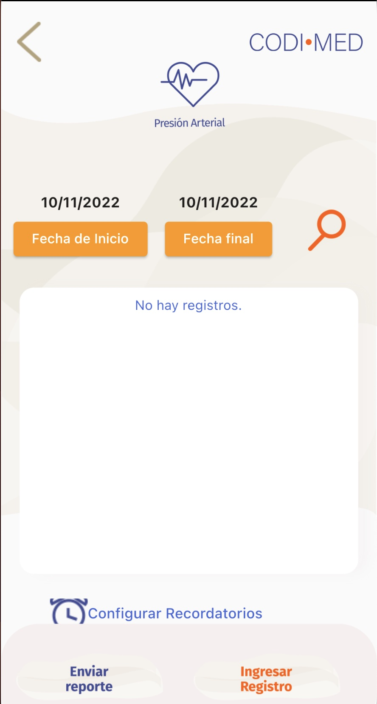
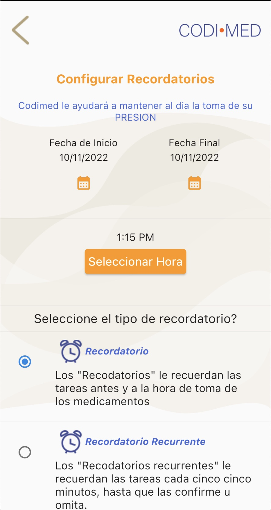

## Roles en el proyecto

- Arquitecto de Aplicaciónes
- Diseño Cloud
- Programación BackEnd
- Coordinación FrontEnd

## Situación

La empresa ya cuenta con una App nativa en Android y desea habilitarla en IOs. Por el costo de mantenimiento se aconseja una solución híbrida que permita deplegar en las dos plataformas con el mismo código. 

## Solución

Se clona la UI y la funcionalidad, se trató de aprovechar el backend sin embargo se encontraron muchas oportunidades de mejora en el backend en lo que respecta a seguridad por lo que se rehizo.

El FrontEnd se hizo con [Flutter](https://flutter.dev/) y el Backend con [NodeJs](https://nodejs.org/en/). 

La exposición a internet por medio de Google Cloud.

### Algunas pantallas del App

[] 

[]

[]

[]

