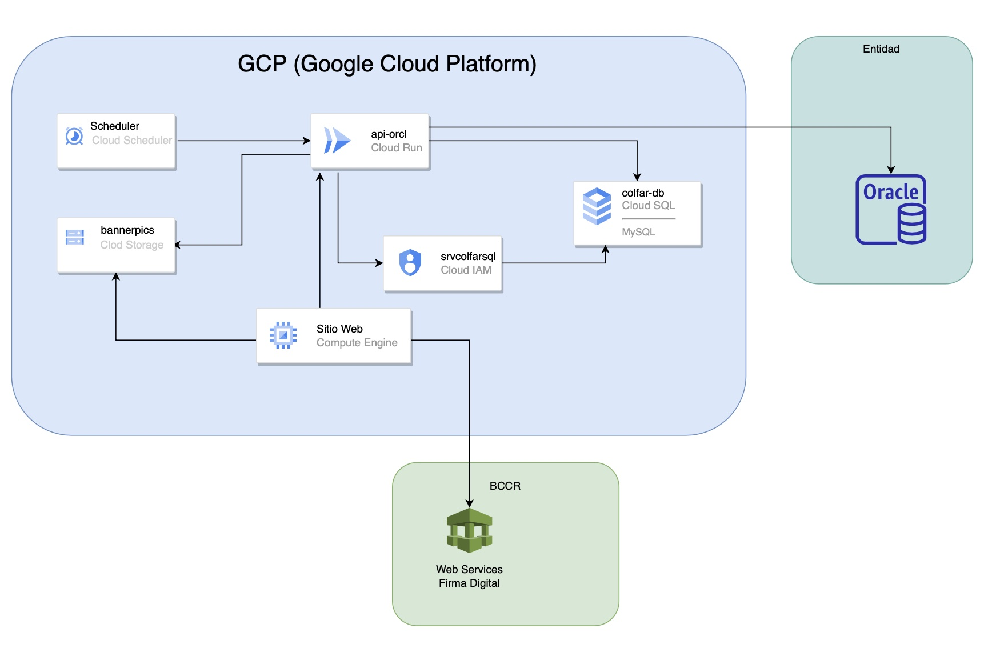

## Roles en el Proyecto

- Arquitecto de Aplicación
- Programador BackEnd
- Coordinador FrontEnd

## Situación

La institución coodinadora de las regencias de las farmación requiere de llevar el control del estado de las temperaturas ambiente y de cámaras de frío de las farmacias. En una primera etapa van a hacer de forma manual, eso si, certificando que los dato ingresados son autoría del farmacéutico. Además se solicita el mostrar banners publicatarios con el objetivo de monetizar el uso del aplicativo.

## Solución

Dado que es una entrada manual y que se hará en los equipos de las farmacias se crea un sitio web expuesto en internet por medio de Google Cloud. La validación de la autoría del ingreso de información se hacer por medio de [firma digital](https://www.mifirmadigital.go.cr/) que ofrece el Banco Central de Costa Rica.

## Arquitectura Conceptual

